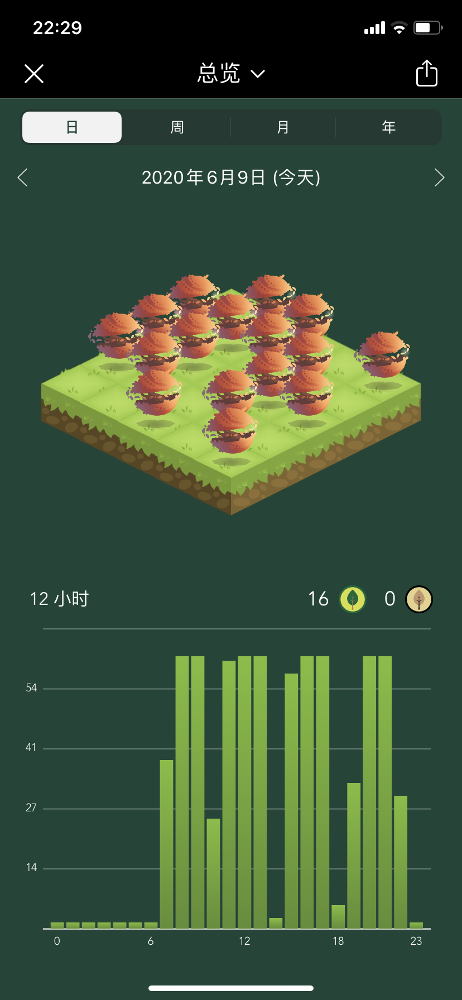

# Day31-200609打卡

### T1 LC01

Python + CPP

### 今日学习记录

| 课 - 时间  | 做了啥（朴实无华的记录）                                     |
| ---------- | ------------------------------------------------------------ |
| **1 - 8**  | 线代课程；                                                   |
| 2 - 9      | 线代课程；                                                   |
| 3 - 10     | C++面试 - C++；One day of Musk；[线代15(31.39)](https://youtu.be/pdnwLQfiJ5U?list=PLRMOX8QaZK8zXgvJ6zMfxcRjiju2BPTlF&t=1899) |
| 4 - 11     | [线代16(17.12)；](https://youtu.be/yNEDyYYgOkU?list=PLRMOX8QaZK8zXgvJ6zMfxcRjiju2BPTlF&t=1032) |
| **5 - 14** | 教务老师电话；线代题库；16(25.49)；                          |
| 6 - 15     | [线代17 - 1.56](https://youtu.be/_WCfax-JK1Y?list=PLRMOX8QaZK8zXgvJ6zMfxcRjiju2BPTlF&t=116) |
| 7 - 16     | [线代17 - 23.11](https://youtu.be/_WCfax-JK1Y?list=PLRMOX8QaZK8zXgvJ6zMfxcRjiju2BPTlF&t=1391) |
| 8 - 17     | 交大视觉邮件；[线代18-6.17](https://youtu.be/jNEZz1KOFUU?list=PLRMOX8QaZK8zXgvJ6zMfxcRjiju2BPTlF&t=377) |
| **9 - 19** | [线代19 - 20.45](https://youtu.be/Pb9LhmlJTH8?list=PLRMOX8QaZK8zXgvJ6zMfxcRjiju2BPTlF&t=1245) |
| 10 - 20    | 力扣01；[线代19 - 42.50](https://youtu.be/Pb9LhmlJTH8?list=PLRMOX8QaZK8zXgvJ6zMfxcRjiju2BPTlF&t=2570) |
| 11 - 21    | [线代22 - 0.07](https://youtu.be/A2m9FWHg-FU?list=PLRMOX8QaZK8zXgvJ6zMfxcRjiju2BPTlF&t=7) |
| 12 - 22    | 再加上[最后一个小时 - 到了24](https://youtu.be/xbYn1HK6mg4?list=PLRMOX8QaZK8zXgvJ6zMfxcRjiju2BPTlF) |

### 今日学习总结

- [x] 认真上课
- [x] 认真学线代
- [x] 明天上午争取结束！

### 今日英语 - 最近暂停了

- [ ] 托福单词打卡
- [ ] 托福单词打卡*2
- [ ] **单号：** T 完成半套 
  - [ ] 阅读至少一篇 - **TPO Passage  /10**
  - [ ] 听力至少3篇 - **TPO **
    - [ ] Set1 - /5
    - [ ] Set2 -/6
  - [ ] 口语全套
    - [ ] Q2
    - [ ] Q3
    - [ ] Q4
    - [ ] Q6
  - [ ] 写作一个
- [ ] **双号：** GRE 学习三小时
  - [ ] GRE 核心词汇助记 List*2
  - [ ] GRE 简单填空*1
  - [ ] GRE 阅读白皮书 Passage*2