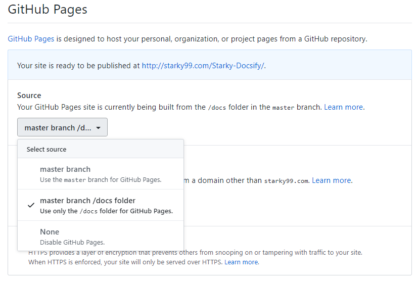

# 我的 docsify 实战文档

使用 Windows + Git Bash

[docsify 官网](https://docsify.js.org/#/)

### 基础环境搭建

1. 首先安装 git 和node.js

   [git 官网](https://git-scm.com/) 和 [node.js 官网](https://nodejs.org/zh-cn/)直接可以下载安装

2. 使用命令安装

   ```bash
   npm i docsify-cli -g
   ```

3. Github 上面搭建一个 Public 的仓库

   我仓库的名字是 **Starky-Docsify**

4. 初始化项目

   ```bash
   $ docsify init ./docs
   
   Initialization succeeded! Please run docsify serve ./docs
   ```

   初始化成功后，可以看到 `./docs` 目录下创建的几个文件

   - `index.html` 入口文件
   - `README.md` 会做为主页内容渲染
   - `.nojekyll` 用于阻止 GitHub Pages 会忽略掉下划线开头的文件

### 开始写文档

直接编辑 `docs/README.md` ，更新网站内容

### 本地预览网站

运行一个本地服务器通过 `docsify serve` 可以方便的预览效果，并且可以实时的预览。

默认访问 [http://localhost:3000](http://localhost:3000/) 

```bash
$ docsify serve docs

Serving C:\Starky\Starky-Docsify\docs now.
Listening at http://localhost:3000
```


相同文件夹下创建一个新文件也很容易：

http://localhost:3000/#/Another


添加图片也很容易，在 MD 中正常添加即可。

### 部署到 Github Pages

- 上传到 Github

- 设置里面 - Sourse设置为 `master branch /docs folder`

- 同时激活 `HTTPS`

  

https://starky99.com/Starky-Docsify/#/

点击 Github 上面自动生成的网站链接，就可以直接访问了。

---

# 我的定制

### Master Branch

我觉得没有必要放在 `docs` 目录下面，放在主目录下面也可以！

两步操作： `重新 init` + `设置里面更换为 master branch` 

```bash
docsify serve .
```

### Default SideBar

**关于侧边栏`_sidebar.md`文件的说明**

- 如果只在根目录有一个`_sidebar.md`文件，那么所有页面都将使用这个一个配置，也就是所有页面的侧边栏都一样。
- 如果一个子目录中有`_sidebar.md`文件，那么这个子目录下的所有页面将使用这个文件的侧边栏。
- `_sidebar.md`的加载逻辑是从每层目录下获取文件，如果当前目录不存在该文件则回退到上一级目录。例如当前路径为`/zh-cn/more-pages`则从`/zh-cn/_sidebar.md`获取文件，如果不存在则从`/_sidebar.md`获取。

### copy to clipboard

```html
<script src="//unpkg.com/docsify-copy-code"></script>
```

### Gittalk