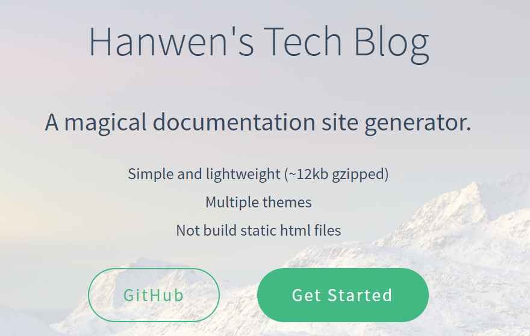
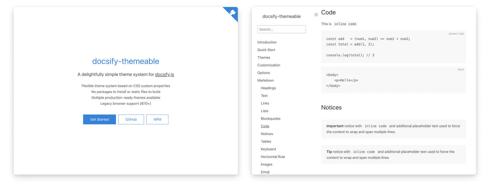
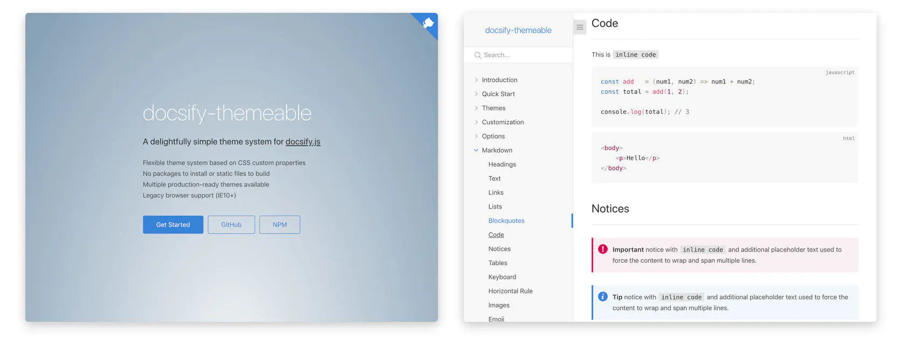
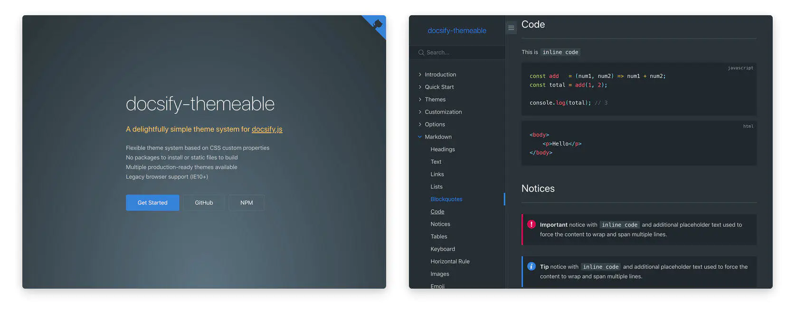

# 我的 docsify 设计文档

使用 Windows + Git Bash

[docsify 官网](https://docsify.js.org/#/)

### 基础环境搭建

1. 首先安装 git 和node.js

   [git 官网](https://git-scm.com/) 和 [node.js 官网](https://nodejs.org/zh-cn/)直接可以下载安装

2. 使用命令安装

   ```bash
   npm i docsify-cli -g
   ```

3. Github 上面搭建一个 Public 的仓库

   我仓库的名字是 **Starky-Docsify**

4. 初始化项目

   ```bash
   $ docsify init ./docs
   
   Initialization succeeded! Please run docsify serve ./docs
   ```

   初始化成功后，可以看到 `./docs` 目录下创建的几个文件

   - `index.html` 入口文件
   - `README.md` 会做为主页内容渲染
   - `.nojekyll` 用于阻止 GitHub Pages 会忽略掉下划线开头的文件

### 开始写文档

直接编辑 `docs/README.md` ，更新网站内容

### 本地预览网站

运行一个本地服务器通过 `docsify serve` 可以方便的预览效果，并且可以实时的预览。

默认访问 [http://localhost:3000](http://localhost:3000/) 

```bash
$ docsify serve docs

Serving C:\Starky\Starky-Docsify\docs now.
Listening at http://localhost:3000
```


相同文件夹下创建一个新文件也很容易：

http://localhost:3000/#/Another


添加图片也很容易，在 MD 中正常添加即可。

### 部署到 Github Pages

- 上传到 Github

- 设置里面 - Sourse设置为 `master branch /docs folder`

- 同时激活 `HTTPS`

  

https://starky99.com/Starky-Docsify/#/

点击 Github 上面自动生成的网站链接，就可以直接访问了。

---

# 我的定制

### Master Branch

我觉得没有必要放在 `docs` 目录下面，放在主目录下面也可以！

两步操作： `重新 init` + `设置里面更换为 master branch` 

```bash
docsify serve .
```

### Default SideBar

侧边栏在 loadSidebar: true 的时候就不会自动渲染了。

**关于侧边栏`_sidebar.md`文件的说明**

- 如果只在根目录有一个`_sidebar.md`文件，那么所有页面都将使用这个一个配置，也就是所有页面的侧边栏都一样。
- 如果一个子目录中有`_sidebar.md`文件，那么这个子目录下的所有页面将使用这个文件的侧边栏。
- `_sidebar.md`的加载逻辑是从每层目录下获取文件，如果当前目录不存在该文件则回退到上一级目录。例如当前路径为`/zh-cn/more-pages`则从`/zh-cn/_sidebar.md`获取文件，如果不存在则从`/_sidebar.md`获取。

### copy to clipboard

两个链接，使用哪一个都可以

```html
<script src="//unpkg.com/docsify-copy-code"></script>

<script src="//cdn.jsdelivr.net/npm/docsify-copy-code"></script>
```

### Gittalk

[这篇博客讲的非常清晰](https://segmentfault.com/a/1190000018072952)

申请一个 [OAuth application](https://github.com/settings/applications/new)

`GitHub OAuth application`允许程序来操作你的github账户，可以对github中仓库读写。

> Application name：必填，OAuth的名字
>
> Homepage URL：必填，你应用的网址，哪个网站用了Gitalk组件，就填写这个网址
>
> Application description：选填，该OAuth的说明
>
> Authorization callback URL：必填，授权成功后回调网址，跟`Homepage URL`参数保持一致就好
>
> 这些参数在注册成功后是可以修改。

注册完成后会进入 [OAuth Apps](https://github.com/settings/developers)

需要里面的 **ClientID** 和 **Client Secret** 及相关信息添加进 index 里面的 js 代码即可。

```html
  <link rel="stylesheet" href="//unpkg.com/gitalk/dist/gitalk.css">
  <script src="//unpkg.com/gitalk/dist/gitalk.min.js"></script>

  <script src="//unpkg.com/docsify/lib/plugins/gitalk.min.js"></script>
  <script>
    var gitalk = new Gitalk({
      	clientID: '40e34717eba550d1ace1',
        clientSecret: 'ae707266376091be268a74105a5946d00d0db424',
        repo: 'Starky-Docsify',
        owner: 'david990917',
        admin: ['david990917'],
        title: location.hash.match(/#(.*?)([?]|$)/)[1],
        id: location.hash.match(/#(.*?)([?]|$)/)[1],
        // facebook-like distraction free mode
        distractionFreeMode: false
    })
    // 监听URL中hash的变化，如果发现换了一个MD文件，那么刷新页面，解决整个网站使用一个gitalk评论issues的问题。
    window.onhashchange = function(event){
      if(event.newURL.split('?')[0] !== event.oldURL .split('?')[0]) {
        location.reload()
      }
    }
    // 由于docsify/lib/plugins/gitalk.min.js文件中已经有下面代码了，所以不需要在写一次了
    // gitalk.render('gitalk-container')
  </script>
```


### 添加封面

_coverpage.md

```markdown
<!-- _coverpage.md -->

# Hanwen's Tech Blog

> A magical documentation site generator.

* Simple and lightweight (~12kb gzipped)
* Multiple themes
* Not build static html files

[GitHub](https://github.com/docsifyjs/docsify/)
[Get Started](#quick-start)

<!-- 背景图片 -->


<!-- 背景色 -->

```

记录样式



​	1.自定义背景配置一定要在`_coverpage.md`文档末尾。

​	2.背景图片和背景色只能有一个生效。

### 配置个人头像

```html
logo: '/_media/hanwen.PNG',
name: 'hanwen',
```

### Github Corner

在预留好的 `repo` 位置填上你的 Github 或者 Github 仓库地址

```html
repo: 'https://github.com/david990917/Starky-Docsify'

repo: 'https://github.com/david990917'
```

### TopMargin

在滚动到指定的锚点时，距离页面顶部有一定空间。

### 主题

原生主题是 Vue

```html
<link rel="stylesheet" href="//unpkg.com/docsify/lib/themes/vue.css">
```

尝试使用默认主题



```html
<!-- Theme: Defaults -->
<link rel="stylesheet" href="https://cdn.jsdelivr.net/npm/docsify-themeable@0/dist/css/theme-defaults.css">
```

Simple 主题



```html
<!-- Theme: Defaults -->
<link rel="stylesheet" href="https://cdn.jsdelivr.net/npm/docsify-themeable@0/dist/css/theme-defaults.css">
```

Simple Dark 主题



```html
<!-- Theme: Simple Dark -->
<link rel="stylesheet" href="https://cdn.jsdelivr.net/npm/docsify-themeable@0/dist/css/theme-simple-dark.css">
```

### 搜索

```html
window.$docsify = {
        search: {
            maxAge: 86400000, // 过期时间，单位毫秒，默认一天
            noData: '找不到结果',//搜索不到结果时显示
            paths: 'auto',//自动
            placeholder: '搜索',//搜索框提示
        },
    }
<script src="//unpkg.com/docsify/lib/plugins/search.min.js"></script>
```

### 静态资源替换

暂时没有操作，但是现在记录一下

```html
<link rel="stylesheet" href="static/css/theme-simple-dark.css">

<script src="static/js/docsify.min.js"></script>
```

### emoji

```html
<script src="//cdn.jsdelivr.net/npm/docsify/lib/plugins/emoji.min.js"></script>
```

### 图片缩放 - Zoom image

```html
<script src="//cdn.jsdelivr.net/npm/docsify/lib/plugins/zoom-image.min.js"></script>
```

### Pagination - 分页导航

```html
<!-- Pagination -->
<script src="//cdn.jsdelivr.net/npm/docsify/lib/docsify.min.js"></script>
<script src="//cdn.jsdelivr.net/npm/docsify-pagination/dist/docsify-pagination.min.js"></script>
```

